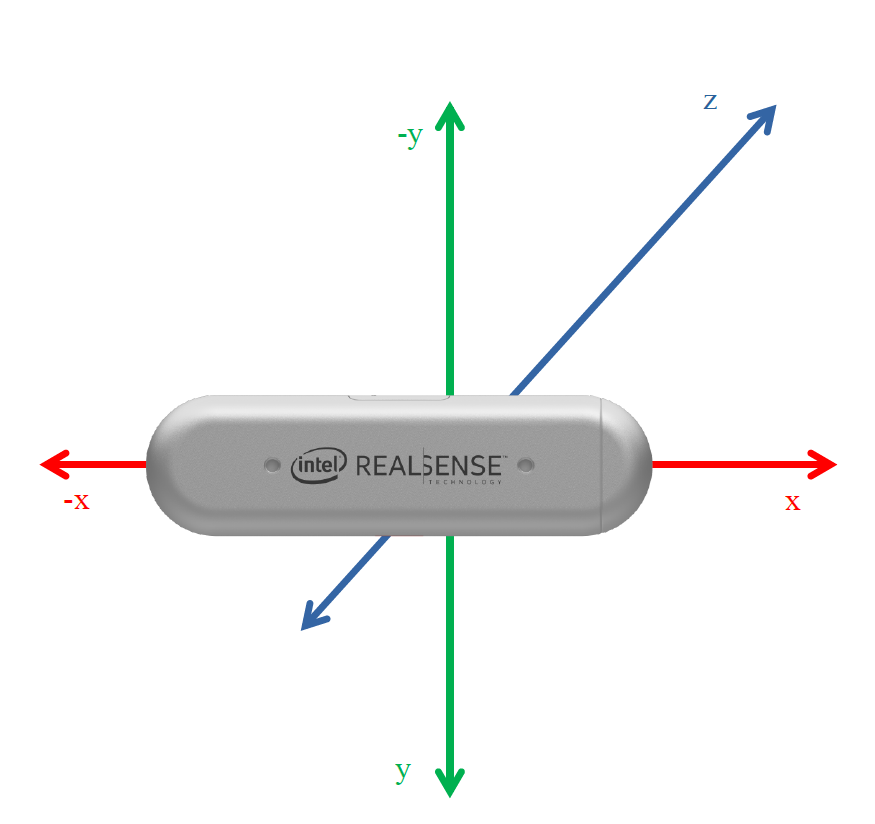

# s3c_cbc_part_detection
## Overview

This Docker container is an implementation of part detection. Essentially, the container operates entirely autonomously. Everything required for part detection is automatically initiated upon the container's startup. This includes, among other components, the Intel RealSense camera topics and the actual part detection process.

The `part_detection_pkg` offers various functionalities. It can provide topics, one of which returns the results of the detection as a JSON dump. Additionally, there is the image topic, which provides a visualization of the results. Moreover, a service is made available. This service can be invoked as desired. A parameter that can be passed is the distance between the work surface and the camera. Upon calling the service, the result of the detection is also returned as a JSON dump. This service offers a resource-saving alternative to the continuously running topics. Upon starting the node, it is possible to determine via parameter whether the topics, respectively, the service should be launched. The "Getting Started" section will delve deeper into the node-specific parameters.

The part detection's actual functionality is as follows:

* For each depth image, it is determined how many contiguous objects are visible in the image.
* For each detected object, it is identified using a simple area based algorithm which object it is `(1, 2)`. The object is than verified with blob detection and circle detection
* Using the camera matrix and a static publisher, the deviation in the `x, y, z` direction relative to the end effector in millimeters is calculated.
* The deviations to the identified parts are returned.

## Getting Started

The following explanation provides an overview of how the container can be used.
Starting the Container

The container is preconfigured such that all relevant components start with a simple compose-up. It is only necessary to ensure that the Intel RealSense is connected to the host before starting the container.

With a successful start, the following topics and services should be available.

At this point, it is worthwhile to examine the `run.sh` file. Here, parameters can be passed that may be relevant for the start of the `part_detection_node`. 
```bash
ros2 run part_detection_pkg part_detection_node \
  --ros-args \
  -p depth_image_topic:='/camera/camera/depth/image_rect_raw' \
  -p depth_info_topic:='/camera/camera/depth/camera_info' \
  -p rgb_image_topic:='/camera/camera/color/image_raw' \
  -p rgb_info_topic:='/camera/camera/color/camera_info' \
  -p depth_plane_threshold:=15 \
  -p depth_dilation:='[20, 20]' \
  -p topics:=true \
  -p services:=true \
  -p depth_area_threshold:=5000 \
  -p num_stack:=5 \
  -p detetion_distance_threshold:=325 \
  -p rgb_blob_max_pairing_distance:=50 \
  -p rgb_circle_max_pairing_distance:=50 \
  -p rgb_min_keypoint_size:=27 \
  -p rgb_blob_min_threshold:=10 \
  -p rgb_blob_max_threshold:=150 \
  -p rgb_blob_threshold_step:=10 \
  -p rgb_blob_min_area:=150 \
  -p rgb_blob_min_circularity:=0.6 \
  -p rgb_circle1_min_radius:=35 \
  -p rgb_circle1_max_radius:=60 \
  -p rgb_circle2_min_radius:=70 \
  -p rgb_circle2_max_radius:=110 \
  -p rgb_medianBlurKSize:=5 \
  -p rgb_cannyThreshold1:=20 \
  -p rgb_cannyThreshold2:=40 \
  -p rgb_houghDP:=1 \
  -p rgb_houghMinDist:=100 \
  -p rgb_houghParam1:=100 \
  -p rgb_houghParam2:=30 \
  -p depth2rgbx:=1.36 \
  -p depth2rgby:=0.98 \
  -p offsetx:=0.8 \
  -p offsety:=0.0 \
  -p areas:='"[ [1, 8200, 50], [2, 22000, 50] ]"' \
  -p rgb_gaussianBlurKSize:='[5, 5]' \
  -p home:='[400.0, -280.0, 625.0, 0.0, 3.543, 0.0]' \
  -p height_1:=475 \
  -p end_height:=350 \
  -p transformation:='[37.2, 32.1, 0.0, 0.0, 0.401, 0.0]'
```

Parameters Description

* `depth_image_topic`: Specifies the ROS topic name from which the node subscribes to receive depth images. These images are critical inputs for the object detection process.

* `depth_info_topic`: Indicates the ROS topic used to obtain camera metadata associated with the depth images. This metadata is vital for accurately interpreting the depth data.

* `rgb_image_topic`: Specifies the ROS topic name from which the node subscribes to receive RGB images. These images provide color information that complements the depth data.

* `rgb_info_topic`: Indicates the ROS topic used to obtain camera metadata associated with the RGB images. This metadata is necessary for accurate color image processing.

* `depth_plane_threshold`: Sets a threshold value in millimeters to filter the depth image. This threshold helps isolate objects by ignoring regions of the image beyond a certain depth.

* `depth_dilation`: Provides the dimensions [width, height] for the dilation operation in the image preprocessing step. Dilation is used to close small gaps within detected objects, enhancing their detectability.

* `topics`: A boolean flag (true or false) that indicates whether the node should publish topics related to detection results and visualizations. This is useful for debugging but can be resource-intensive.

* `services`: A boolean flag (true or false) that determines whether a ROS service for part detection should be available. This service provides a resource-efficient means to obtain detection results on demand.

* `depth_area_threshold`: A minimum area threshold for detected objects in the depth image. Objects with an area below this threshold will not be considered in the detection results.

* `num_stack`: Defines the number of images to stack for averaging to reduce noise in depth image processing.

* `detection_distance_threshold:` Sets a maximum distance threshold in millimeters between depth centers and RGB centers for considering detected objects. Objects beyond this distance are ignored.

* `rgb_blob_max_pairing_distance`: Specifies the maximum distance in pixels for pairing detected blobs in the RGB image. This helps in accurately identifying connected components.

* `rgb_circle_max_pairing_distance`: Specifies the maximum distance in pixels for pairing detected circles in the RGB image. This aids in the accurate detection of circular objects.

* `rgb_min_keypoint_size`: Sets the minimum size in pixels for keypoints detected in the RGB image. Keypoints smaller than this size are ignored.

* `rgb_blob_min_threshold`: Sets the minimum threshold for detecting blobs in the RGB image. Blobs with a value below this threshold are ignored.

* `rgb_blob_max_threshold`: Sets the maximum threshold for detecting blobs in the RGB image. Blobs with a value above this threshold are ignored.

* `rgb_blob_threshold_step`: Defines the step size for thresholding in blob detection. This step size helps in iterating through multiple threshold levels to accurately detect blobs.

* `rgb_blob_min_area`: Specifies the minimum area in pixels for detected blobs. Blobs smaller than this area are ignored.

* `rgb_blob_min_circularity`: Sets the minimum circularity value for detected blobs. Blobs with circularity below this value are ignored, aiding in the detection of circular shapes.

* `rgb_circle1_min_radius`: Defines the minimum radius in pixels for the first type of circles detected in the RGB image.

* `rgb_circle1_max_radius`: Defines the maximum radius in pixels for the first type of circles detected in the RGB image.

* `rgb_circle2_min_radius`: Defines the minimum radius in pixels for the second type of circles detected in the RGB image.

* `rgb_circle2_max_radius`: Defines the maximum radius in pixels for the second type of circles detected in the RGB image.

* `rgb_medianBlurKSize`: Specifies the kernel size for the median blur operation applied to the RGB image. Median blur helps in reducing noise while preserving edges.

* `rgb_cannyThreshold1`: Sets the first threshold for the Canny edge detector applied to the RGB image. This threshold helps in identifying strong edges.

* `rgb_cannyThreshold2`: Sets the second threshold for the Canny edge detector applied to the RGB image. This threshold helps in identifying weak edges connected to strong edges.

* `rgb_houghDP`: Defines the inverse ratio of the accumulator resolution to the image resolution in the Hough Circle Transform. This parameter is used in detecting circles in the RGB image.

* `rgb_houghMinDist`: Specifies the minimum distance between the centers of detected circles in the RGB image. This helps in avoiding multiple detections of the same circle.

* `rgb_houghParam1`: Sets the higher threshold for the Canny edge detector used by the Hough Circle Transform. This helps in edge detection during circle detection.

* `rgb_houghParam2`: Sets the accumulator threshold for the Hough Circle Transform. Only circles with enough votes (accumulated edges) are considered.

* `depth2rgbx`: Defines the scaling factor in the x-direction for aligning depth image coordinates with RGB image coordinates. This transformation is necessary for accurate object localization.

* `depth2rgby`: Defines the scaling factor in the y-direction for aligning depth image coordinates with RGB image coordinates. This transformation is necessary for accurate object localization.

* `offsetx`: Sets a static offset in the x-direction to adjust the detected object positions. This helps in aligning the object coordinates from the camera’s perspective to the robot’s coordinate system.

* `offsety`: Sets a static offset in the y-direction to adjust the detected object positions. This helps in aligning the object coordinates from the camera’s perspective to the robot’s coordinate system.

* `areas`: Specifies a list of objects for object detection. Each object is defined by a list containing the objec-ID, the area, and a threshold. These  are crucial to label the different objects correctly.

* `home`: Defines the "home" position of the robot as a list of coordinates and orientation values.

* `height_1`: Sets the height in millimeters for the robot arm during the fine positioning process. 

* `end_height`: Defines the final height in millimeters for the robot arm after finding the part.

* `transformation`: Specifies a transformation vector to define the transformation betwenn camera and endeffector.


## Topics & Services
The part_detection_pkg creates two topics and one service, explained in more detail below.

When intending to use the service provided by the part_detection_pkg, it's crucial to ensure that the part_detection_interfaces package is built on the machine that intends to utilize the service. This step is necessary to make the custom service (srv) known to the system. Building the part_detection_interfaces package compiles the custom service definitions, allowing ROS2 to recognize and properly handle the service calls made to part_detection/detect. This ensures that when a service call is made, the system can correctly interpret the request and response structure defined by the custom service, facilitating seamless communication between nodes.

### Topic: /part_detection/detection_results
This topic returns the detection results as a dictionary formatted as a string. For detection to be carried out, knowing the distance between the camera and the work surface is essential. Since this value constantly changes in continuous detection, the median from the depth image is extracted, representing the work surface.

```bash
ros2 topic info /part_detection/detection_results
ros2 topic echo /part_detection/detection_results
```

### Topic: /part_detection/visual_results
Based on the /part_detection/detection_results topic, this is an image topic that visualizes the results.

Visual debugging can be best conducted in RViz2.

### Service: /part_detection/detect
This service provides object detection on demand. The camera_height parameter, a float representing the distance from the camera to the work surface in millimeters, can be passed during the service call. If this parameter is not provided, the distance is calculated using the median value as well. The result of the detection is returned as a JSON dump, ensuring that the data is easily accessible and can be programmatically processed for further applications.

```bash
ros2 service call /part_detection/detect part_detection_interfaces/srv/DetectObjects "{camera_height: 250.0}"
```

### Service: /part_detection/find_object
This service can be used to find a specific part. The payload is the label of the searched part, the return value is a single list with delats `[x, y, z, rx, ry, rz]`, and a truth value whether the part was found. The exact use of this service is described in `integration.md`.

```bash
ros2 service call /part_detection/find_object part_detection_interfaces/srv/FindObject "{label: 1}"
```

### Service: /part_detection/find_object_exact 
This service is used if the part has already been found and roughly controlled. The service is designed for fine adjustment. The return value is again a list with the deltas. A truth value `done` is also returned. The service is to be called until this is true. After it is true, the robot must be moved again according to the returned deltas in order to execute the transformation The exact application of this service is described in `integration.md`.

```bash
ros2 service call /part_detection/find_object_exact part_detection_interfaces/srv/FindObjectExact "{}"
```

### service: /part_detection/search_object
This service returns all parts with the label 0. The return value is a JSON dump. The idea of this service is to find all parts that could not be assigned to a class. This can be helpful if a part is actually there but cannot be found. So we can move the robot arm close to the unknown parts in the hope that the part will be recognized correctly. The exact use of this service is described in `integration.md`.

Translated with DeepL.com (free version)
```bash
ros2 service call /part_detection/search_object part_detection_interfaces/srv/SearchObject "{}"
```

## Interpretation of Results
Both the result topic and the `/part_detection/detect` service call generate the same structure of results. This uniformity ensures that regardless of the method used to obtain the detection results, the format of the data remains consistent and straightforward to interpret. Here's an example of what a result looks like:

```plaintext
response: part_detection_interfaces.srv.DetectObjects_Response(json_results='{"labels": ["1", "2"], "deltas": [[-0.6, -49.5, 155.5], [-116.8, 246.0, 231.1]}')
```

The result is returned as a JSON dump encapsulated in a response object. The JSON structure contains two main fields: labels and deltas.

The other three services have already been briefly described above and are explained in more detail in `integration.md`.

### Data
`labels`: This array holds the identification of each detected object. In the provided example, three objects have been identified as "1" and "2", respectively. These labels correspond to the categories the neural network model has been trained to recognize.

`deltas`: This array contains the positional deviations for each detected object relative to a reference point, typically the camera's position or the end effector if transformed with the static transformation. The deviations are provided as arrays of three values representing the x, y, and z axis in millimeters. For instance, the first object ("1") has a deviation of -0.6mm on the x-axis, -49.5mm on the y-axis, and 155.5mm on the z-axis from the reference point. The following visualisation shows how the values can be interpreted: 


