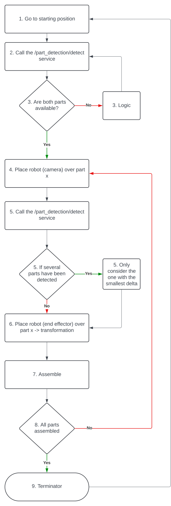
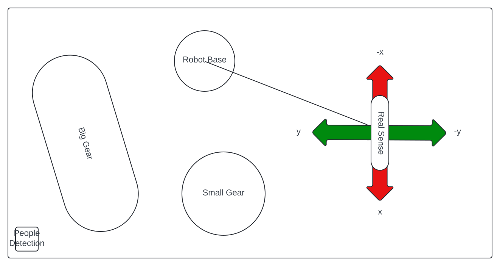

# Integration of part detection
In order to successfully integrate part detection 
some points must be observed.
This document is intended to provide a guideline 
to carry out the integration successfully.

## Description
At the moment, the neural network is not used for part detection.
This is still being developed and improved.
Accordingly, part detection is currently based on a simple,
area-based approach with object verification on the RGB image with blob detection and circle detection.
The parts are recognized with connected component labeling and verified with blob detection and circle detection
and then assigned to a class based on the area.

## Logic
The following visualization shows roughly what the process could look like. The exact integration is described in the following chapter.



## Integration

The following three services are used for integration:
* `/part_detection/find_object`
* `/part_detection/find_object_exact`
* `/part_detection/search_object`

The following steps should be processed in this order:
1. Move the robot to the home position. This is important, because the services return deltas, so it is relevant to know the start position, especially the height is critical.
2. Call `/part_detection/find_object`. This call returns how the robot must move to reach the desired part
Move robot
3. Call `/part_detection/find_object_exact`. This call gives us the deltas for fine adjustment. This service should be executed until `done` is set to `true`. Once `done` is `true`, we still need to move the robot again to account for the transformation between the camera and the end effector
4. Pick up part
5. Assemble part
6. Assume start position


Once all these steps have been completed, we can continue with the next part. If no part is recognized from the beginning, although it is there, the service `/part_detection/search_object` can be used. It returns all parts with label 0 so we can move the robot in the direction of the unknown parts to again search for a specific part.

How the services can be called is described in the `readme.md`.


## Positions
Most of the Positions are handled by the services, so the only important position is the home position. The robot has to be at this exact position or at least this hight before the `/part_detection/find_object` service is called.

### Starting position
According to the teach pad:

```angular2html
x: 400, y: -280.00, z: 625.00,
rx: 0.000, ry: 3.543, rz: 0.000
```

### 2nd height
This is handled by the services.

```angular2html
z: 475
```

### End height
This is handled by the services.

```angular2html
z: 350
```

### Transformation

The transformation is given in millimeters and has the form (x, y, z).
The following transformation is calculated for the current camera mount. Status 14.08.2024
The Transformation is handled by the services

```angular2html
transformation_x = 37.2
transformation_y = 32.1
transformation_z = 0.0
transformation_rx = 0.0
transformation_ry = 0.401
transformation_rz = 0.0
```

## Control
All services return a list of deltas as the return value. These deltas always relate to the robot position at the time the service was called. To calculate the next position, the current position must be adjusted by applying the delta values accordingly. Below is an outline of how this calculation should be performed:

```angular2html
x_new = x_current - delta_y
y_new = y_current - delta_x
z_new = z_current - delta_z

rx_new = rx_current - delta_rx
ry_new = ry_current - delta_ry
rz_new = rz_current - delta_rz
```

The following visualizations shows how the deltas can be interpreted from the point of view of the realsense.




According to this visualization, a delta_x of 10 would mean that the camera must be moved 10mm in the negative x-direction.
A delta_y of -10 would mean that the camera must be moved 10mm in the positive y-direction.
